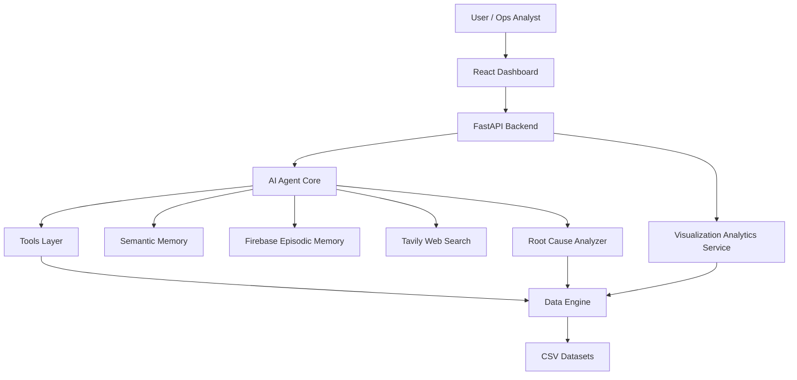

# RosterIQ

RosterIQ is a memory-driven AI operations intelligence system for healthcare provider roster pipelines. It combines a FastAPI backend, a Groq-powered agent, operational analytics, root-cause investigation, and a React dashboard to help teams diagnose stuck files, failure spikes, rejection patterns, and market performance drops.

## Project Overview

Healthcare provider roster pipelines involve multiple stages, retries, validations, and downstream system dependencies. When performance drops, operations teams often need to correlate file-level issues, market metrics, stage anomalies, and historical investigation context.

RosterIQ brings those signals together in one system:

- A backend analytics layer for roster and market data
- An AI agent that routes questions to the correct tools
- Episodic and semantic memory for investigation continuity and domain context
- Root-cause analysis for market degradation
- A React dashboard with chart-ready operational insights

## System Architecture



See the full architecture write-up in [docs/architecture_diagram.md](docs/architecture_diagram.md).

## Key Features

- Natural-language investigation through a Groq-powered AI agent
- FastAPI analytics and agent endpoints
- Firebase episodic memory for recent investigation recall
- Semantic memory for pipeline terminology and metric definitions
- Tavily web search integration for compliance and external context questions
- Root-cause analysis for market success degradation
- Visualization-ready analytics for charts and operational dashboards
- React dashboard with Recharts-based visuals

## Technology Stack

- Backend: FastAPI, Python, Pandas, DuckDB-ready architecture
- Agent: Groq via OpenAI-compatible API
- Memory: Firebase Firestore and JSON semantic memory
- Search: Tavily
- Frontend: React
- Visualization: Recharts

## Setup Instructions

### 1. Install Python dependencies

```bash
cd RosterIQ
pip install -r requirements.txt

```

### 2. Environment Setup

Copy the example file and provide the required credentials:

```bash
copy .env.example .env
```

Set the following values in `.env`:

- `GROQ_API_KEY`
- `TAVILY_API_KEY`
- `FIREBASE_PROJECT_ID`
- `FIREBASE_CLIENT_EMAIL`
- `FIREBASE_PRIVATE_KEY`
- `FASTAPI_ENV`

The Firebase private key can remain a single environment-variable value. Escaped newlines such as `\n` are converted automatically at runtime.

### 3. Run the FastAPI backend

```bash
uvicorn backend.main:app --reload
```

Run this command from the `RosterIQ/` directory.

### 4. Install frontend dependencies

```bash
cd frontend 
npm install
```

### 5. Start the React dashboard

```bash
npm start
```

If needed, set `REACT_APP_API_BASE_URL` in `.env` so the frontend points to the FastAPI backend URL.

## Demo Flow

Use these questions during a demo:

1. `Which pipelines are currently stuck?`
2. `Why is CA market success dropping?`
3. `What compliance rules affect provider organizations?`

During the walkthrough, highlight:

- Agent tool routing
- Root-cause panel output
- Pipeline health chart
- Market trend chart
- Retry effectiveness chart

The full demo narration is in [docs/demo_script.md](docs/demo_script.md).

## Judge-Friendly Endpoints

- `GET /procedures` lists all named procedural workflows.
- `POST /procedures/{name}/run` executes a specific procedure (optional body: `{ "state": "CA" }`).
- `GET /memory/status` shows whether episodic memory is currently using Firebase or local JSON fallback.

## Quick Validation

Run smoke tests for judging-critical capabilities:

```bash
python -m unittest backend.tests.test_judging_readiness
```

## Example Screenshots

Add screenshots before submission for maximum clarity:

- `docs/screenshots/dashboard-overview.png`
- `docs/screenshots/root-cause-panel.png`
- `docs/screenshots/agent-query-response.png`

## Future Improvements

- Move from pandas CSV loading to DuckDB query execution
- Add multi-step tool planning instead of keyword routing
- Support persistent semantic memory editing from the UI
- Add richer dashboard filtering by state, organization, and time range
- Expand root-cause analysis with confidence scoring and supporting evidence
- Add screenshot assets and a short narrated demo video for submission
