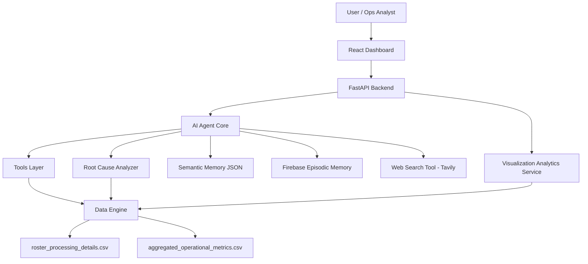

# RosterIQ Architecture Diagram

## Data Flow Summary

`React Dashboard` sends analytics and agent requests to the `FastAPI Backend`.

For natural-language questions, FastAPI hands the request to the `AI Agent Core`, which selects tools, looks up semantic definitions, checks episodic memory, optionally calls `Tavily` for external context, and can invoke the `Root Cause Analyzer`.

For charts and operational views, FastAPI uses the `Visualization Analytics Service`, which reads processed data from the `Data Engine`.

The `Data Engine` loads and normalizes the two CSV datasets and serves both the analytics layer and the agent tool layer.
